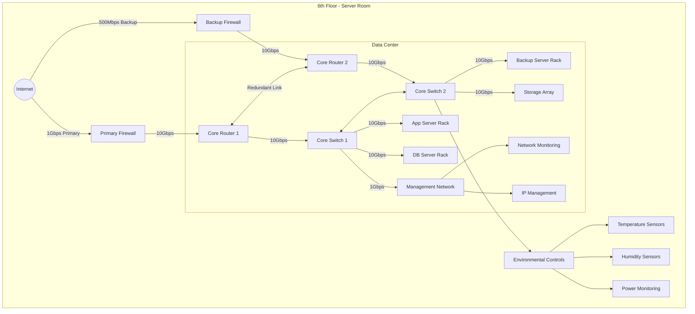
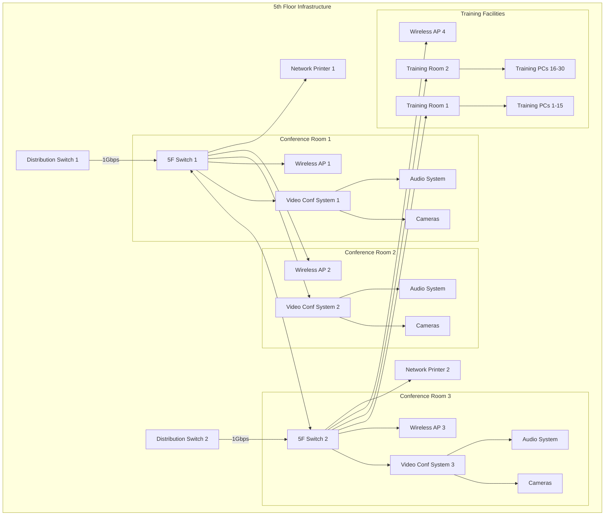
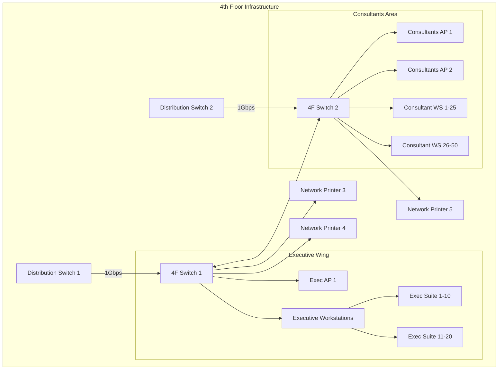
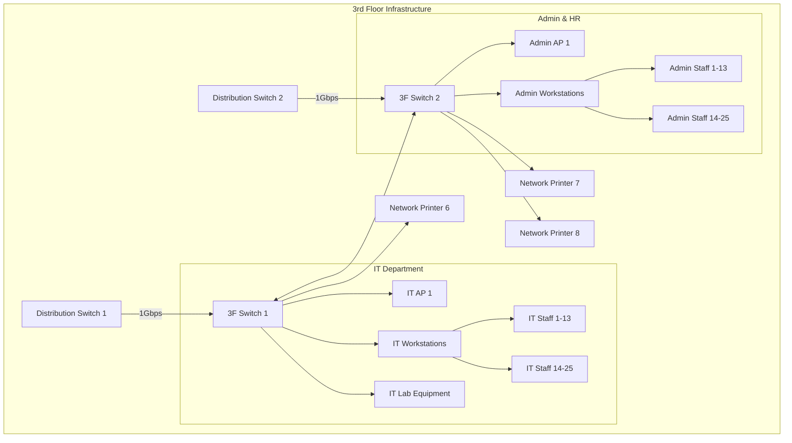
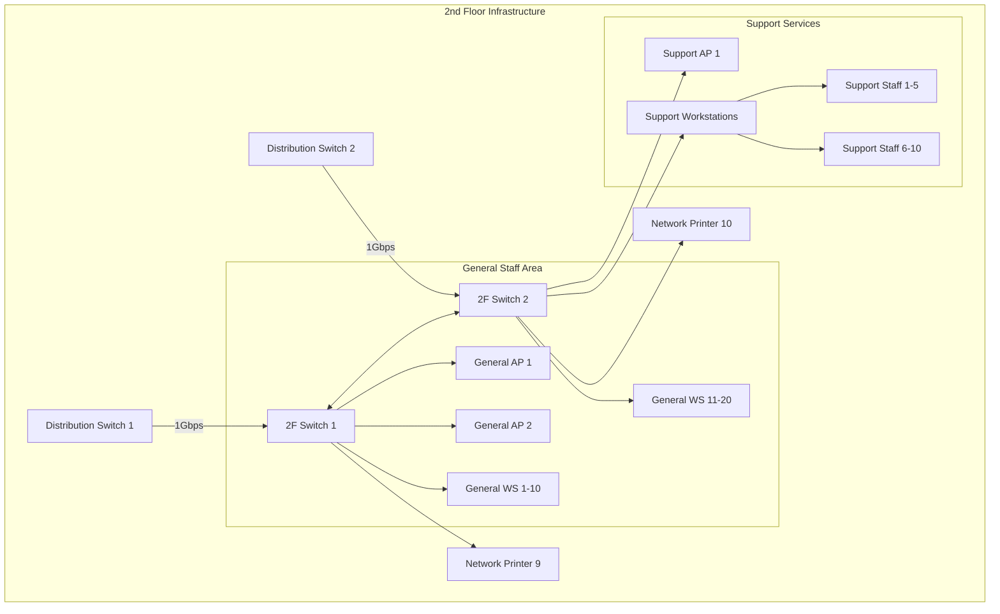

## Floor-by-Floor Network Topology Diagrams

### 6th Floor - Server Room and Core Infrastructure

### 5th Floor - Training & Conference Rooms

### 4th Floor - Executive & Business Consultants

### 3rd Floor - IT & Administrative Staff

### 2nd Floor - General Staff & Support

## Network Specifications Per Floor

### 6th Floor - Server Room
- **Core Network Equipment**:
  - Dual Firewalls (Primary: 1Gbps, Backup: 500Mbps)
  - Redundant Core Routers (10Gbps)
  - Core Switches with 10Gbps uplinks
- **Server Infrastructure**:
  - Application Server Rack
  - Database Server Rack
  - Backup Server Rack
  - Storage Array
- **Management Systems**:
  - Network Monitoring
  - IP Management
  - Environmental Controls

### 5th Floor - Conference Level
- **Network Coverage**:
  - 4 Enterprise APs (One per major area)
  - PoE+ enabled switches
- **Conference Rooms**:
  - Dedicated video conferencing systems
  - HD cameras and audio systems
  - 1Gbps dedicated connections
- **Training Rooms**:
  - 30 Training PCs
  - Dedicated APs
  - 2 Network Printers

### 4th Floor - Executive Level
- **Network Coverage**:
  - 3 Enterprise APs (Executive + Consultant areas)
  - PoE+ enabled switches
- **Executive Wing**:
  - 20 Executive workstations
  - Premium WiFi coverage
  - 3 Network Printers
- **Consultant Area**:
  - 50 Workstations
  - Dual AP coverage

### 3rd Floor - IT & Admin
- **Network Coverage**:
  - 2 Enterprise APs
  - PoE+ enabled switches
- **IT Department**:
  - 25 IT staff workstations
  - Lab equipment connections
  - 3 Network Printers
- **Admin Area**:
  - 25 Administrative workstations
  - Dedicated AP coverage

### 2nd Floor - General Staff
- **Network Coverage**:
  - 3 Enterprise APs
  - PoE+ enabled switches
- **General Staff Area**:
  - 20 Workstations
  - 2 Network Printers
- **Support Services**:
  - 10 Support staff workstations
  - Dedicated AP coverage

## Additional Specifications

### Wireless Networks Per Floor
1. **Corporate SSID**:
   - 802.1x authentication
   - WPA3-Enterprise
   - VLAN segregation per department

2. **Guest SSID**:
   - Portal authentication
   - Rate limited
   - Isolated from corporate network

3. **IoT SSID** (where applicable):
   - Device certificate authentication
   - Restricted network access

### Security Measures
- VLAN segregation per department
- ACLs between VLANs
- NAC for device authentication
- Regular security scans
- Traffic monitoring and analysis

### QoS Implementation
- Voice/Video: Priority queuing
- Business Apps: Guaranteed bandwidth
- General Traffic: Best effort
- Guest Traffic: Rate limited
